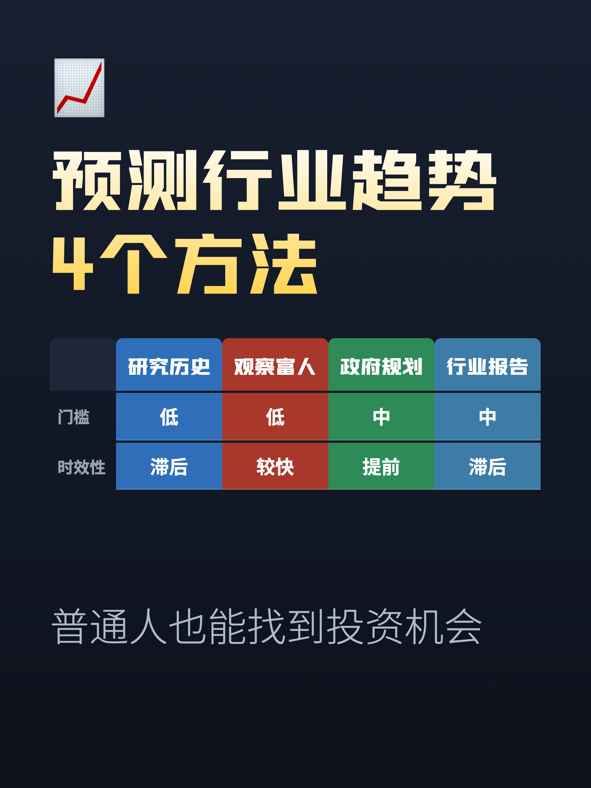
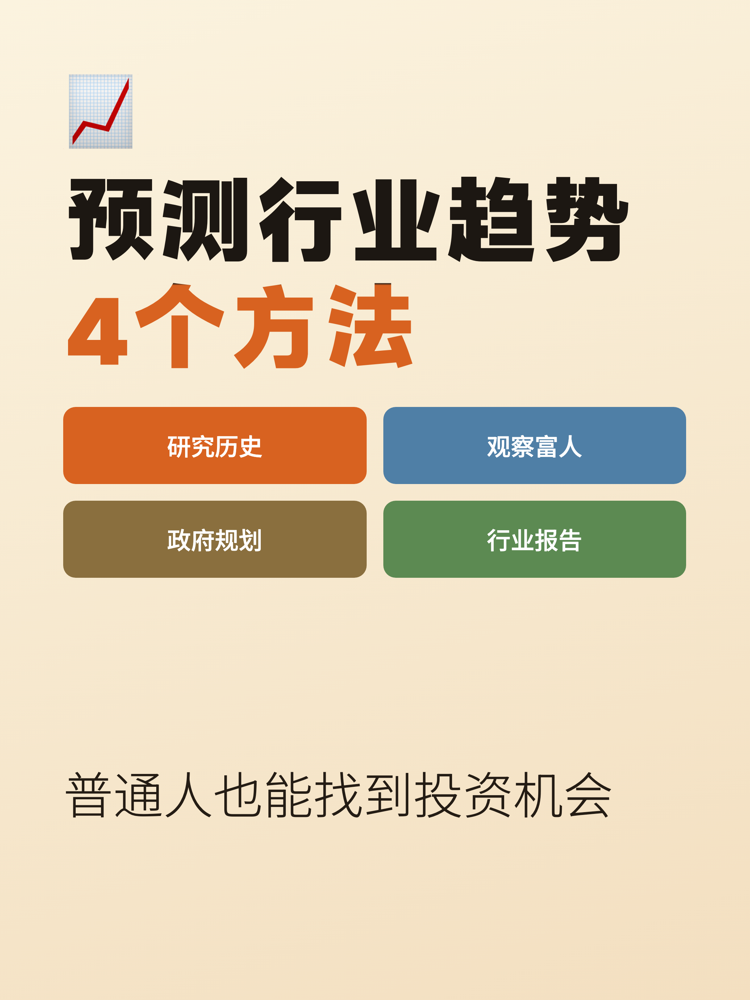
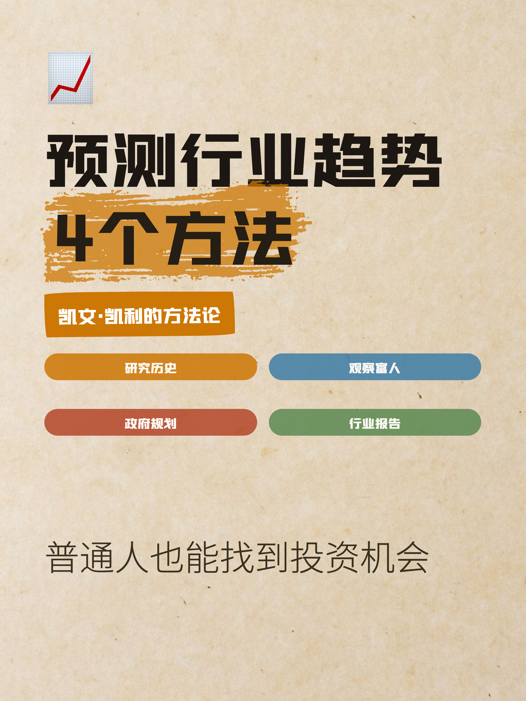
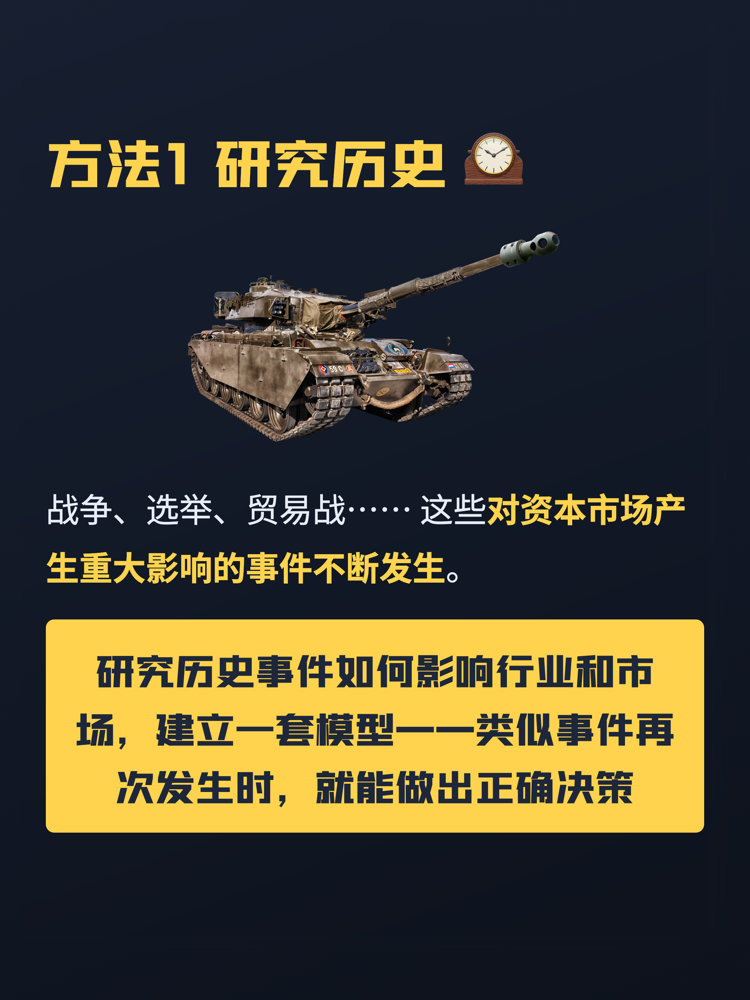
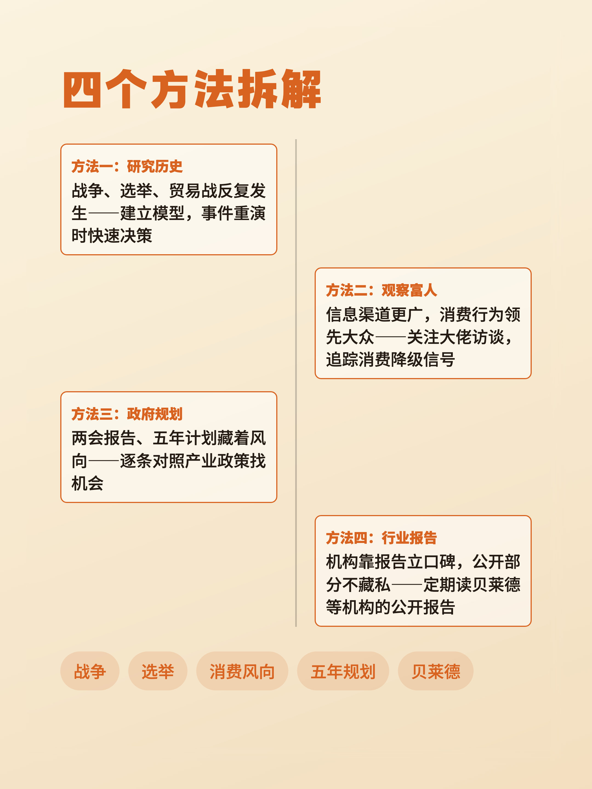
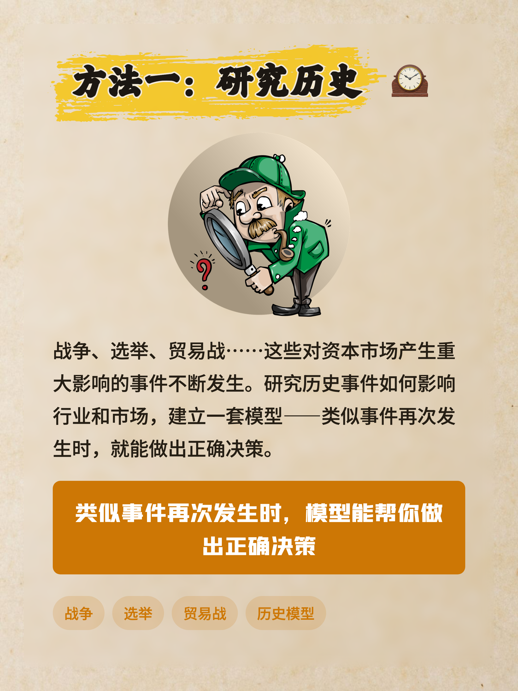

## 📕 xhs-card-studio · 小红书图文卡片 Agent Skill

> 从一份 `content.md` 生成一组风格统一的 3:4（1080×1440）小红书图文卡片，
> 全程 HTML + Chromium 渲染，**不用 AI 生图**。
> Fork 自 [comeonzhj/Auto-Redbook-Skills](https://github.com/comeonzhj/Auto-Redbook-Skills)，
> 重写了主题系统、加了版式组件库和渲染前自检 🙌

---

## 🚀 安装

这是一个 **Agent Skill**：装进会自己读指令、自己跑脚本的编程 Agent 里，跟它正常
对话就行，**不是让你自己敲命令行的工具**。

### 方式一：Claude Code

```bash
git clone https://github.com/xxliu1996/AutoRednotesSkill.git ~/.claude/skills/xhs-card-studio
```

装完不用你自己再做别的——Claude 第一次实际用到这个 skill 时会自己检查依赖、
自己建虚拟环境（`scripts/check_deps.sh` 幂等，Claude 会在需要时调用它，不影响
系统环境或其他 skill）。之后正常对话即可触发：

> 帮我把这份 content.md 做成小红书图文卡片

Claude 能识别"小红书图文""笔记配图""多图轮播卡片"这类描述，自动发现并调用
这个 skill。

### 方式二：Codex CLI / 其他支持自定义技能的 Agent

把仓库整个目录放进该工具读取自定义技能/指令的位置（不同工具的约定不同，具体
看对应工具的文档），确保 `SKILL.md` 能被 Agent 读到即可——里面是完整的工作流
说明，Agent 照着执行，包括在需要时自己调用 `scripts/check_deps.sh` 装依赖。

### 可选：配置自动配图（Pixabay）

内容需要配图但你没有现成素材时，Agent 会调用 `scripts/fetch_images.py` 去
Pixabay 图库检索候选图——这一步需要一个免费的 API key，不配也不影响核心的
出图功能，只是少了自动配图这一项。

1. 去 <https://pixabay.com/accounts/register/> 免费注册（已有账号可跳过）
2. 登录后打开 <https://pixabay.com/api/docs/>，页面顶部会显示你的 API key
3. 用下面两种方式之一告诉 skill 这把 key（二选一即可）：

```bash
# 方式一：环境变量（每次新终端都要重新 export，或写进 shell 配置文件）
export PIXABAY_API_KEY=你的key

# 方式二：写成文件（一次性，推荐）
echo "你的key" > ~/.claude/skills/xhs-card-studio/.pixabay_key
```

限流是 100 次 / 60 秒，正常用法碰不到。`.pixabay_key` 已经在 `.gitignore`
里，不会被 git 追踪。详见 [`references/image-sourcing.md`](references/image-sourcing.md)。

---

## ✨ 亮点

- **不代写内容** —— 文案由你在 `content.md` 里定稿，skill 负责审查、配版式、出图
- **不用 AI 生图** —— 卡片是用真实 HTML/CSS 渲染的（Playwright 截图），字是真的字、
  排版是真的排版，不会有 AI 生图常见的文字乱码、结构跑偏
- **🎨 3 套主题，全部从真实小红书样图逐张提取**（不是配色模板，是真实账号的
  构图习惯，见下方「已收录的主题」），也支持你自己丢一张样图进来提取新的一套
- **🧱 组件化排版**：多栏栅格、编号圆徽、正反对比、步骤流、放射状 Hub、
  之字形时间轴、十字象限图……不是所有卡片都只能是"标题+一段话"
- **📐 4 种分页模式**：`separator` 按 `---` 手动分页 ｜ `auto-split` 按渲染高度
  自动拆分 ｜ `auto-fit` 固定尺寸整体缩放 ｜ `dynamic` 按内容动态调整高度
- **🔍 渲染前自检**：出图前自动检查溢出、卡片内容偏空、封面孤字、缺字形、
  分类配色未用、素材缺失，不用等出图之后才发现问题

---

## 🖼 主题效果示例

> 所有示例均为 1080×1440px，小红书推荐 3:4 比例。完整素材（含各主题的
> `content_cards_<theme>.md` 源文件）见 [`examples/predicting-industry-trends/`](examples/predicting-industry-trends/)

同一份关于"如何预测行业趋势"的内容，分别用 `dark-gold`（财经风）、`marker-duo`
（职场干货风）、`kraft-marker`（科普手绘风）三套主题出图：

| dark-gold | marker-duo | kraft-marker |
|---|---|---|
|  |  |  |
|  |  |  |

同一份文案，三套主题的版式语言完全不同——这是 skill 的核心设计：**版式不是配色
换皮，是每套主题自己的构图习惯**。

---

## 📝 使用方式

1. 写一份 `content.md`（见下方格式说明，或直接照抄 `demos/content.md`）
2. 跟 Agent 说"用这个 skill 帮我出图"，或者直接描述需求
3. Agent 会先问你挑哪套主题（也可以直接说"用 kraft-marker"跳过这一步）
4. 出图前会先做一遍内容审查 + 客观体检，有问题会告诉你，不会直接甩一堆图过来
5. 确认后出图，`cover.png` + `card_1.png`、`card_2.png`……

全程不需要你手动跑 Python 脚本——上面这些都是 Agent 在背后调用
`scripts/render_xhs.py` 完成的。

<details>
<summary>调试/进阶：自己手动跑命令行（一般用不到）</summary>

```bash
cd ~/.claude/skills/xhs-card-studio
source .venv/bin/activate

# 体检，不出图
python scripts/render_xhs.py content.md -t kraft-marker --dry-run

# 出图
python scripts/render_xhs.py content.md -t kraft-marker -o out/
```

**主要参数：**

| 参数 | 简写 | 说明 |
|------|------|------|
| `--theme` | `-t` | 主题名，见下方「已收录的主题」 |
| `--mode` | `-m` | 分页模式：`separator` / `auto-fit` / `auto-split` / `dynamic` |
| `--width` | `-w` | 图片宽度（默认 1080） |
| `--height` | | 图片高度（默认 1440） |
| `--dpr` | | 设备像素比（默认 2） |
| `--dry-run` | | 只体检不出图 |
| `--materials-dir` | | 素材目录（默认 md 文件所在目录） |

完整参数见 [`references/params.md`](references/params.md)。

</details>

### `content.md` 格式

```markdown
---
emoji: "🚀"
title: "主题<br>数字承诺"   # 可用 <br> 手动断行
subtitle: "封面副标题"
---

# 第一张卡的标题

正文，**加粗**，`行内代码`。

- 列表项
- 列表项

---

# 第二张卡的标题

用 `---` 手动分隔卡片。
```

结尾可以放 `#标签1 #标签2`，会渲染成标签胶囊。详细语法（组件、素材、分页模式）见
[`SKILL.md`](SKILL.md) 和 [`references/layout-authoring.md`](references/layout-authoring.md)。

---

## 🎨 已收录的主题

这个仓库只收录 **3 套主题**，没有通用内置主题——不追求"主题多"，追求"每套都是真的从样图里抠出来的"：

| 主题 | 视觉语言 | 适合内容 |
|---|---|---|
| `dark-gold` | 深蓝底 + 金色标题，行标签对比矩阵 | 财经、评测、多方案对比 |
| `marker-duo` | 米橙底 + 黑橙双色大标题，放射状 Hub、之字形时间轴 | 职场干货、步骤教程 |
| `kraft-marker` | 牛皮纸底 + 马克笔高光/黄色荧光笔框，贴纸标签 | 科普、知识点讲解 |

每套主题的版式规律（哪些组件、什么配色逻辑）记在各自的 `assets/themes/<theme>.custom.css`
注释里和 `references/layout-authoring.md`「主题专属组件」一节，改主题或加新
版式之前建议先看，不要凭感觉照抄另一套主题的用法（见 `SKILL.md`「多主题
防串味」）。

### 自己提取一套新主题

给一张真实小红书样图，让 Agent 帮你提取风格：

> 参考这张样图帮我做一套新主题

流程见 [`references/style-extraction.md`](references/style-extraction.md)——是一个
"量 → 判断 → 再量差距"的收敛循环，不是一次性生成。

---

## 📁 项目结构

```bash
xhs-card-studio/
├── SKILL.md                skill 入口，工作流说明
├── README.md                项目文档（你现在看到的）
├── requirements.txt          Python 依赖
├── scripts/
│   ├── render_xhs.py         主渲染器（含 --dry-run 体检）
│   ├── themes.py             主题注册表
│   ├── materials.py          素材内联与 SVG 清洗
│   ├── build_theme.py        风格 token → 主题 CSS
│   ├── preview_theme.py      单主题预览
│   ├── style_probe.py        风格探针（量样图色板/明暗）
│   ├── fetch_images.py       图库检索（Pixabay）
│   └── check_deps.sh         依赖安装
├── assets/
│   ├── themes/                3 套主题的 CSS / JSON token / custom.css 逃生舱
│   ├── components.css         版式组件库
│   └── materials.css          素材样式
├── references/                各类使用说明与踩坑记录
├── demos/                     内置示例 content.md
└── examples/
    └── predicting-industry-trends/   完整实战示例（见下）
```

## 🧪 完整实战示例

[`examples/predicting-industry-trends/`](examples/predicting-industry-trends/) 是一份真实
跑过的示例：同一份「如何预测行业趋势」的内容，分别为 `dark-gold`、`marker-duo`、
`kraft-marker` 三套主题写了各自的版式（`content_cards_<theme>.md`），并附上渲染
好的成品图（`output/<theme>/`）。想看 skill 实际产出效果、或者想抄一份内容结构
当模板改，从这里开始最快。

---

## ⚠️ 注意事项

1. **字体授权**：`kraft-marker` / `marker-duo` 用到的展示字体
   （如 `zihunzhengkuchaojihei`、`ZHDH`）多数是商用需授权的个人字库，仓库里
   **不包含字体文件**——主题 CSS 只是引用字体族名，渲染时如果你的系统没装
   同名字体会自动回退到 `Noto Sans SC`，效果会跟示例图有出入。要跟示例图一致
   需要自己去字体厂商网站获取正版授权后安装到系统里。
2. **不负责发布**：这个 skill 只出图片文件，不包含自动发布到小红书的功能。
3. **图片尺寸**：默认 1080×1440px，符合小红书推荐 3:4 比例。

---

## 🙏 致谢

- [comeonzhj/Auto-Redbook-Skills](https://github.com/comeonzhj/Auto-Redbook-Skills)（MIT）——
  本项目的基座，唯一原生支持 `content.md` 输入、1080×1440 默认渲染尺寸的开源方案
- [Playwright](https://playwright.dev/) - 浏览器自动化渲染
- [Pixabay](https://pixabay.com/) - 部分主题的配图/纹理素材来源

在 fork 基础上新增了素材内联、样图风格提取、版式组件库、渲染前内容审查与交付
自检、封面标题排版修复等。改动细节见 [`SKILL.md`](SKILL.md) 「改动记录」一节。

---

## 📄 License

MIT
