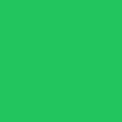

# 行内素材 🎯

正文里直接用原生 markdown 图片语法引用素材，路径相对 `--materials-dir`。

上面这张流程图用的是 `fill="currentColor"`，**换主题会自动跟着变色**。

---

# 尺寸与对齐 📐

`alt` 文本里写指令：`size` 取 `sm/md/lg/xl/hero`，`align` 取 `left/center/right`。素材靠左浮动时正文自动绕排，标题会自动清除浮动。

- 不写 size 默认 `md`
- 硬编码了颜色的素材加 `recolor` 强制跟随主题色

---

# 强制改色与顶部通栏 🎨

`hero` 是卡片顶部通栏插图。线性图形用 `recolor=stroke`。

 这张原本是蓝底白勾，`recolor` 只换填充，白勾保留。

---

# 脏 SVG 与缺失素材 🛡️

下面这张 SVG 带 `<script>`、`onclick` 和外链图片，内联前会被清洗：

这一张故意指向不存在的文件，应当渲染成刺眼的红色占位块：

