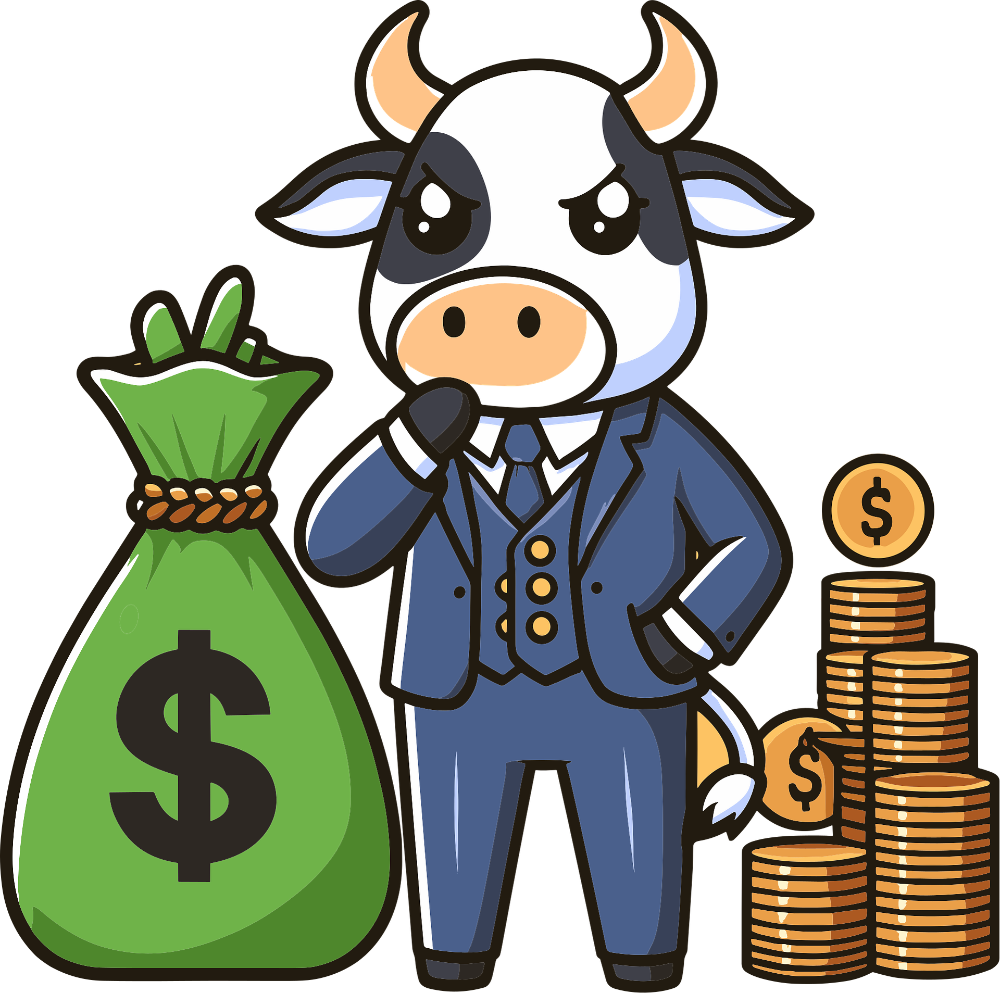

## 💡如何预测行业趋势，寻找投资机会
📖 最近读了两本书，凯文•凯利的《2049: 未来10000天的可能》和《5000天后的世界》！凭借对科技发展的洞察，作者对科技将如何重塑未来社会做出了大胆预言。我比较关注的是作者预测未来的方法！

### 研究历史🔍
历史上发生过的事情会换一种方式重新发生。战争，选举，贸易战…… 这些对资本市场会产生重大影响的事件不断发生。通过研究历史事件如何影响行业和资本市场，我们可以建立一套模型，当类似的事件再次发生时，就能做出正确的投资决策！

### 观察富人💸
富人获得信息的渠道比普通人要广得多，同时他们的言行本身就会对行业，资本市场产生巨大影响。所以，从现在开始关注一些科技，金融界大佬的推特，收听对他们的采访。他们时不时也会做出对未来的预测，这在一定程度上代表资本市场的风向。同时，随着技术和行业的发展，过去很多只有富人才能消费得起的商品和服务，未来也会走入普通人的生活。关注富人的消费行为，也是一种预测未来的好方法！

### 关注政府规划文件📃
政府的意志对经济发展的重要性不言自明。在中国，这几乎可以说是有着决定性作用。每年两会期间的政府工作报告，每五年发布的五年计划，都蕴藏着许多行业发展趋势和投资机会。如果你想深耕当地政府，那么就可以结合国家和地方政府的文件一起看。即使在美国这样资本主导的国家，国家政策的影响也很巨大。例如，特斯拉的崛起离不开政府对新能源汽车的补贴政策，在早期，这笔补贴可以说是特斯拉的“救命钱”！

### 研读经济，行业报告📃
无论是官方的还是民间的投资机构，咨询公司定期都会发布行业报告，比如贝莱德发布的AI行业报告。当然了，这些以盈利为目的的机构，他们不会把最精华的信息公开发布，往往是需要花费巨额的订阅费才能得到第一手信息。但是，公开的报告里也有很多有用信息值得挖掘。因为，他们也要靠这些报告塑造影响力，吸引客户。

⚡️ 过去，搜集和分析这些信息门槛还很高，但现在有了AI的助力💻，这项工作变得容易起来！最大的阻力可能就是我们的惰性了！研究未来经济发展趋势，寻找投资机会，是摆在我们每个人面前的课题！