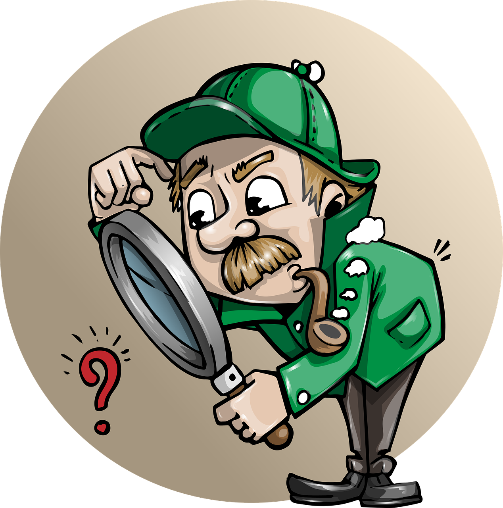

凯文·凯利的方法论

研究历史

观察富人

政府规划

行业报告

# 从两本书说起 📖

真正值钱的不是他的预言，而是他**预测未来的方法**

《2049：未来10000天的可能》和《5000天后的世界》——这四个方法，普通人现在就能用。

凯文·凯利
未来预测
认知模型

---

# 方法一：研究历史 🕰️

战争、选举、贸易战……这些对资本市场产生重大影响的事件不断发生。研究历史事件如何影响行业和市场，建立一套模型——类似事件再次发生时，就能做出正确决策。

类似事件再次发生时，模型能帮你**做出正确决策**

战争
选举
贸易战
历史模型

---

# 方法二：观察富人 💸

富人获得信息的渠道比普通人广得多，言行本身就影响市场。关注科技、金融界大佬的推特和访谈；同时留意富人的消费行为——今天的奢侈品，可能是明天的大众消费。

今天的奢侈品，**可能是明天的大众消费**

科技大佬
消费风向
推特访谈

---

# 方法三+四 📃

政府规划文件

经济行业报告

两会工作报告、五年计划里藏着投资机会；机构报告公开部分也有干货。

连美国也一样：特斯拉早期的新能源补贴就是救命钱

两会报告
五年规划
贝莱德

---

# 最大的阻力是惰性 ⚡

过去搜集和分析这些信息门槛很高，现在有了 AI 助力，这项工作容易多了。

研究历史

观察富人

政府规划

行业报告

研究未来经济发展趋势、寻找投资机会，是摆在每个人面前的课题

#投资理财 #行业趋势 #凯文凯利 #认知升级 #副业思维 #AI工具 #读书笔记
