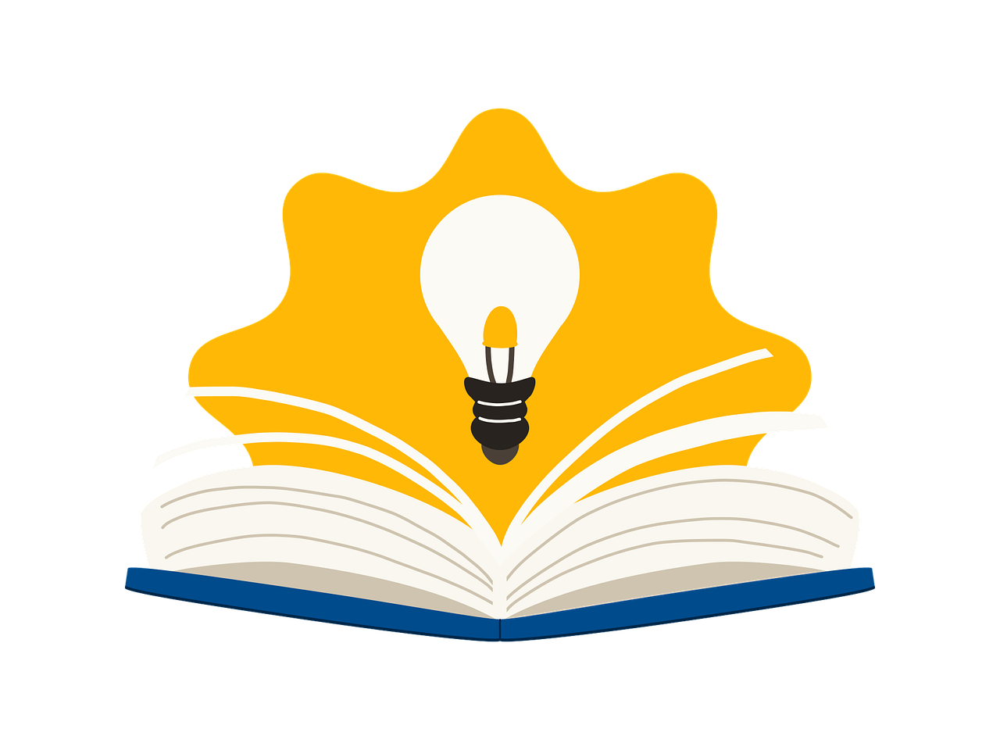

研究历史

观察富人

政府规划

行业报告

# 从两本书说起 📖

真正值钱的不是凯文·凯利的预言，而是他**预测未来的方法**

《2049：未来10000天的可能》和《5000天后的世界》——凯文·凯利凭对科技发展的洞察，多次精准预言未来社会形态。这四个方法，普通人现在就能用。

凯文·凯利
科技预言
认知升级
未来预测

---

# 四个方法拆解

方法一：研究历史

战争、选举、贸易战反复发生——建立模型，事件重演时快速决策

方法二：观察富人

信息渠道更广，消费行为领先大众——关注大佬访谈，追踪消费降级信号

方法三：政府规划

两会报告、五年计划藏着风向——逐条对照产业政策找机会

方法四：行业报告

机构靠报告立口碑，公开部分不藏私——定期读贝莱德等机构的公开报告

战争
选举
消费风向
五年规划
贝莱德

---

# 最大的阻力是惰性 ⚡

过去搜集和分析这些信息门槛很高，需要花大量时间盯盘、翻研报、找访谈。现在有了 AI 助力，检索和总结的工作被极大压缩，这项工作容易多了。

研究未来经济发展趋势、寻找投资机会，是摆在每个人面前的课题

真正的门槛从来不是信息，而是**要不要开始**。

#投资理财 #行业趋势 #凯文凯利 #认知升级 #副业思维 #AI工具 #读书笔记
