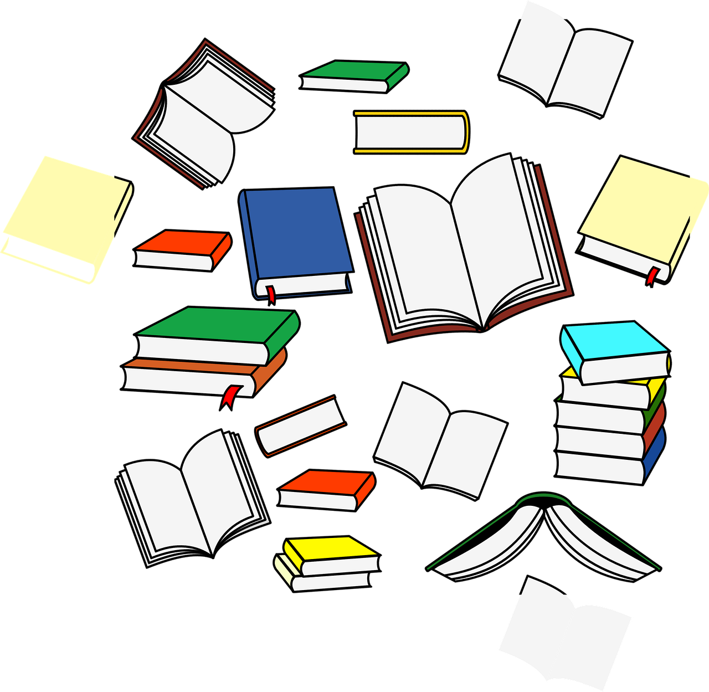

研究历史
战争、选举、金融危机

观察富人
采访、演讲、消费方式

政府文件
政策、数据、发展规划

行业报告
行业趋势、投资方向

# 从两本书说起

读了凯文·凯利的《2049：未来10000天的可能》和《5000天后的世界》，作者对科技如何重塑未来做出了大胆预言。**但真正值钱的不是预言，而是他预测未来的方法。**

预言会过期，方法不会。这四个方法，普通人现在就能用。

⚠️ 股市有风险，以上内容仅作科普，不代表任何投资建议

---

# 方法一：研究历史

**战争、选举、贸易摩擦、金融危机**会对资本市场产生重大影响，也会产生许多投资机会。研究历史事件如何影响市场，就能建立自己的模型——类似事件重演时做出正确决策。

重大事件广为传播的时候，资本市场已经做出了反应。这个时候入场只有被割的命，要学会预判，提前布局。

⚠️ 股市有风险，以上内容仅作科普，不代表任何投资建议

---

# 方法二：观察富人

富人获得信息的渠道比普通人广得多，他们的言行本身就会对行业和资本市场产生巨大影响。**更重要的是，学习他们思考和行为的模式。**

今天只有富人消费得起的商品，明天会走进普通人的生活。关注富人的消费行为，也是预测未来的好方法。

⚠️ 股市有风险，以上内容仅作科普，不代表任何投资建议

---

# 方法三：政府规划文件

政府意志对经济发展的重要性不言自明，在中国几乎有决定性作用。每年两会的工作报告、五年计划，都藏着行业趋势和投资机会。

**在美国政策影响也很大**——特斯拉早期的新能源补贴，就是它的"救命钱"。

Check List...

<ul class="todo">
<li>国家信息中心</li>
<li>地方政务平台</li>
<li>国家与地方文件结合看</li>
</ul>

⚠️ 股市有风险，以上内容仅作科普，不代表任何投资建议

---

# 方法四：研读行业报告

官方和民间的投资机构、咨询公司定期都会发布行业报告。这些以盈利为目的的机构不会把最精华的信息公开，但**公开报告里仍有很多有用信息值得挖掘**——因为它们也要靠这些报告塑造影响力、吸引客户。

Check List...

<ul class="todo">
<li>贝莱德：定期发布 AI 等行业报告</li>
<li>艾瑞：行业分析、数据洞察</li>
<li>益普索：消费者洞察与市场研究</li>
</ul>

⚠️ 股市有风险，以上内容仅作科普，不代表任何投资建议

---

# 最大的阻力是惰性

过去搜集和分析这些信息门槛很高，现在有了 AI 的助力，这项工作容易多了。**真正的门槛从来不是信息，而是要不要开始。**

Start Here...

<ul class="todo">
<li>先挑一个行业，只跟这一个</li>
<li>每周固定时间读一份公开报告</li>
<li>把结论写下来，事后回看准不准</li>
</ul>

⚠️ 股市有风险，以上内容仅作科普，不代表任何投资建议

#投资理财 #行业趋势 #凯文凯利 #认知升级 #读书笔记
